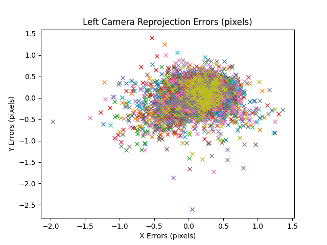
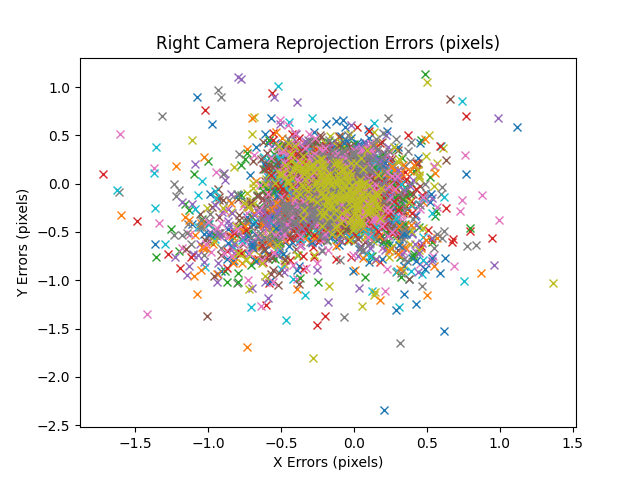
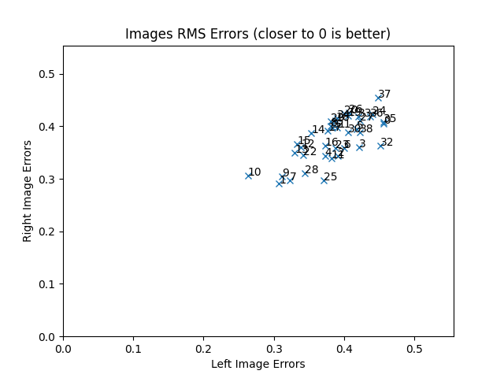

<h1 align="center">
  <br>
  Stereo Calib
  <br>
</h1>

<h4 align="center">Calibration for Stereo Cameras</h4>

<p align="center">
  <a href="#introduction">Introduction</a> •
  <a href="#dataset">Dataset</a> •
  <a href="#intrinsic-parameter-estimation">Intrinsic Parameter Estimation</a> •
  <a href="#stereo-calibration">Stereo Calibration</a> •
  <a href="#image-rectification">Image Rectification</a> •
  <a href="#disparity-map">Disparity Map</a> •
  <a href="#depth-map">Depth Map</a> •
  <a href="#calibration-analysis">Calibration Analysis</a>

</p>

## Introduction

In this report, we focus on the calibration and analysis of a horizontal stereo camera, including the
estimation of intrinsic and extrinsic parameters, rectification of images, and the application of stereo rectification
to generate a disparity and depth map.

The process encompasses:

* **Intrinsic Parameter Estimation**: Determining the internal characteristics of the camera, such as focal length,
  optical centre and distortion coefficients, which are crucial for converting camera coordinates to pixel coordinates.
* **Stereo Calibration**: Determining the rotation
  matrix ($R$) and translation matrix ($T$) of the left camera coordinate system with respect to the right camera
  coordinate
  system.
* **Image Rectification**: Aligning the optical axes of the two cameras to ensure accurate stereo vision by making the
  images line-aligned.
* **Disparity Map Calculation**: Computing the disparity map, which represents the difference in the x-coordinate of the
  same point in the left and right images, essential for depth estimation.
* **Depth Map Calculation**: Utilising the disparity map and the baseline to compute the depth map, providing depth
  information for each pixel in the image.

## Dataset

The dataset provided includes **39 stereo image pairs** captured by the wide angle stereo camera system, featuring
synchronized left and right images. These images contain Charuco calibration patterns, a combination of Chessboard and
ArUco markers, which are essential for the calibration process.

## Intrinsic Parameter Estimation

### Justification of Camera Model

Given the dataset's origin from a wide-angle stereo camera system, the rational polynomial distortion
model (`cv2.CALIB_RATIONAL_MODEL`) is selected. This distortion camera model is known for its ability to capture complex
distortions, both radial and tangential, common in real-world imaging. This model extends the capabilities of simpler
models like the pinhole camera
model by incorporating additional distortion parameters, aiming to achieve higher calibration accuracy and enhancing
image quality.

### Equations

* **Intrinsic Parameters**: The camera matrix ($K$) includes the focal lengths ($f_x$) and ($f_y$) along the x and y
  axes, and
  the principal point coordinates (($c_x$, $c_y$)).

```math
K = \begin{bmatrix} f_x & 0 & c_x \\ 0 & f_y & c_y \\ 0 & 0 & 1 \end{bmatrix}
```

* **Distortion Parameters**: Radial distortion coefficients ($k_1$, $k_2$, $k_3$) and tangential distortion
  coefficients ($p_1$, $p_2$) are used to correct for image distortions caused by lens imperfections.
* **Rational Model**: The rational model extends the distortion model by introducing additional coefficients ($k_4$,
  $k_5$, $k_6$) to accommodate higher-order distortions, enhancing the model's ability to correct for complex lens
  distortions.
* **Optimisation**: The calibration process optimises both intrinsic and distortion parameters using iterative
  algorithms (based on least-squares method) like Levenberg-Marquardt to minimize reprojection error. We
  use `cv2.aruco.calibrateCameraCharuco` that leverages Charuco detected corners to ensure accurate parameter
  estimation.

For robust calibration, it is recommended to detect a minimum of 5 to 10 corners (points) per image on the Charuco
board. Given the dataset consisting of 39 stereo pairs of images, detecting more points per image will enhance the
accuracy and
robustness of the camera calibration.

Additionally, we ensure the utilisation of Charuco corner points that are commonly
visible by both cameras, thereby reinforcing the consistency and reliability of the calibration process.

## Stereo Calibration

Once both cameras are individually calibrated, we proceed with stereo calibration to determine their relative geometric
relationship. This step involves utilising the `cv2.stereoCalibrate` function, where the calibrated camera parameters
obtained in the previous step serve as initialisation.

* **Initial Parameters**: Calibrated camera matrices, distortion coefficients, object points and corresponding image
  points from both cameras.
* **Rational Model**: The same camera model (`cv2.CALIB_RATIONAL_MODEL`) is utilised.
* **Optimisation**: The function optimises the camera matrices and distortion coefficients to minimise the re-projection
  error between corresponding points in the left and right images, which is the difference between the observed and
  projected points.

Upon successful stereo calibration, the algorithm provides essential outputs such as the relative rotation ($R$) and
translation ($T$) between the cameras, rectification transforms, and projection matrices for both cameras, which is
essential
for image rectification, disparity map computation, and depth map generation.

## Image Rectification

Using the rotation matrix ($R$), translation vector ($T$), and camera matrices obtained from `cv2.stereoCalibrate`, we
rectify the images to ensure they are line-aligned. We employ `cv2.stereoRectify` function that computes the
rectification transforms for each camera, which include rotation matrices ($R_1$, $R_2$) and projection matrices
($P_1$, $P_2$) for the new (rectified) coordinate systems. It also outputs a disparity-to-depth mapping matrix ($Q$) and
rectangles inside
the rectified images where all the pixels are valid ($validPixROI_1$, $validPixROI_2$).

## Disparity Map

After rectifying stereo image pairs, we compute disparity map using StereoSGBM (Semi-Global Block Matching) algorithm
that compares small blocks of pixels in the left and right images to find the best match and calculate the disparity.
The algorithm includes smoothing to avoid small speckles which further improves the quality of dispairty map. Finally,
we apply a WLS (Weighted Least Squares) filter to further refine the disparity map, ensuring greater accuracy and
clarity.

## Depth Map

Utilizing the disparity map computed in the above step and the disparity-to-depth mapping matrix ($Q$), we generate a
three-dimensional representation of the scene. We achieve this by employing the `cv2.reprojectImageTo3D` function, which
seamlessly converts pixel disparities into spatial coordinates, effectively constructing a depth map. The
$Q$ matrix encapsulates crucial parameters such as the baseline between stereo cameras and the formula for converting
depth
to disparity, typically represented as:

```math
depth = \frac{f. T}{disparity}
disparity = u_L - u_R
```

where $f$ denotes the focal length of the camera and $T$ represents the baseline distance between the stereo camera
setup. $u_L$ and $u_R$ represent the horizontal pixel coordinates of corresponding points in the left and right stereo
images, respectively.

## Calibration Analysis

### Camera Reprojection Errors

We obtained an RMS error of 0.3402, which ideally should be less than 0.4 for a well-calibrated system. The camera
re-projection error plot illustrates a circular cluster centered around 0 for both cameras, indicating accurate and
consistent calibration.





### Left vs Right RMS error

The plot below helps us easily identify the pair of images with poor corner re-projection performance. The worst
performing pair of images will be in the top right and best performing on the bottom left. Each cross represents an
image pair with the number next to it representing the pairs ID.

